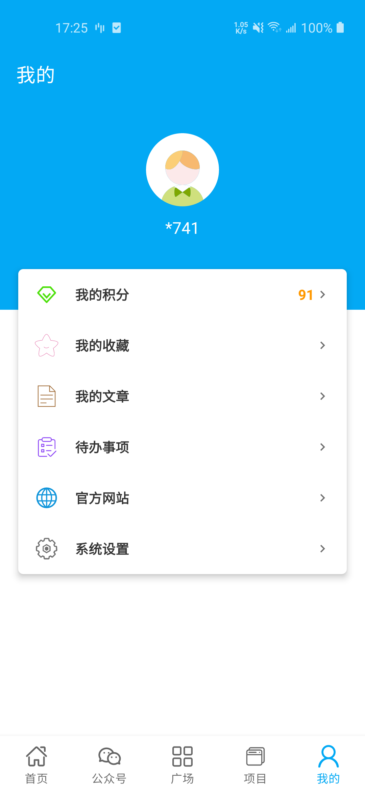
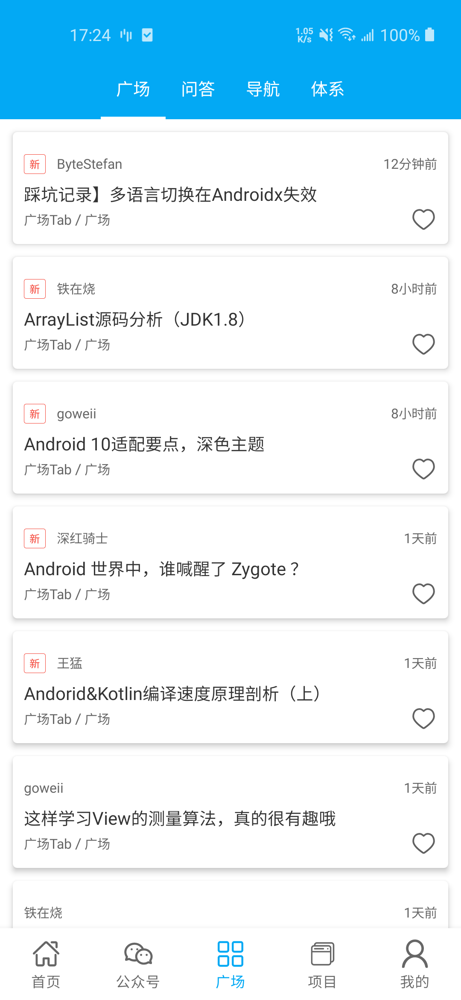
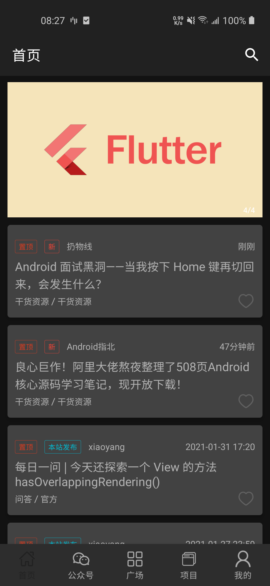
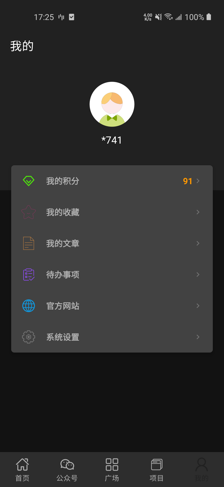
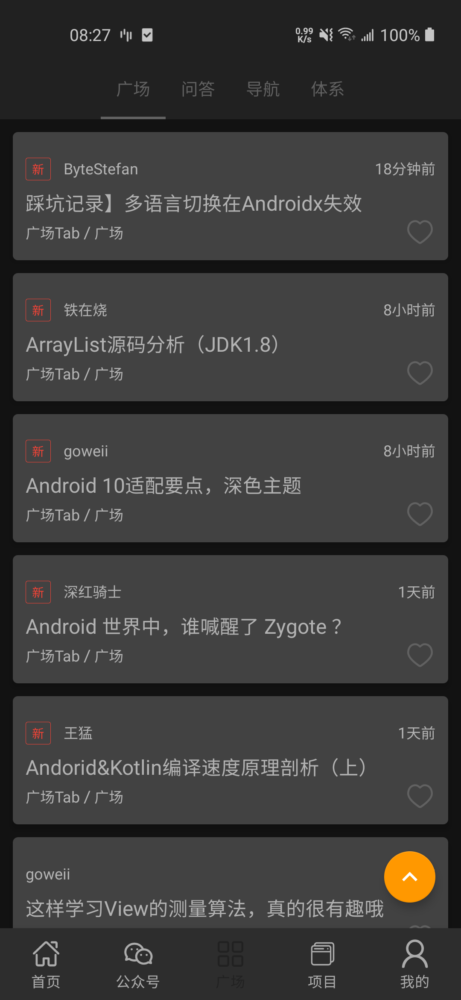

## Kotlin+JetPack+协程实现的MVVM架构Wanandroid客户端

- 项目基于Kotlin语言，采用ViewModel+LiveData实现MVVM架构。
- 网络请求采用协程+Retrofit，数据库采用Room。
- 适配了Android黑夜模式。

## 项目截图
 | | 
:-------------------------:|:-------------------------:|:-------------------------:
 | | 

## 技术要点

####  Kotlin+Jetpack+Coroutines+Retrofit+koin

## 首页功能
首页分为5个Tab，主要为首页、公众号、广场、项目和我的。

整个页面框架使用BottomNavigationView + Navigation来搭建。通过menu来配置底部菜单。
通过NavHostFragment来配置各个fragment。系统提供的FragmentNavigator的navigate方法中是通过replace来加载fragment。
这就导致在切换Tab的时候fargment会重复的调用onCreateView方法。这肯定不是我们需要的。那么我们需要自定义自己的FragmentNavigator来替换系统
的，通过show和hide的方式来加载fragment。